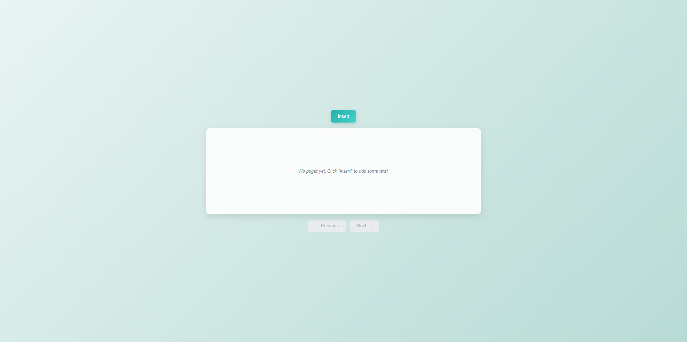

# pyCardShuffle

A lightweight Flask app for splitting text into cards/pages and navigating them with a clean web or desktop interface.



## Table of Contents

- [Overview](#overview)
- [Features](#features)
- [Getting Started](#getting-started)
  - [Prerequisites](#prerequisites)
  - [Installation](#installation)
  - [Uninstall](#uninstall)
- [Usage](#usage)
- [License](#license)

## Overview

pyCardShuffle is a minimal text navigation tool. Paste text, split it with `---`, and move through the resulting cards/pages with next/previous controls. It can run locally in your browser or be built as a standalone desktop application with a single script.

## Features

- Insert text and auto-split into cards/pages with `---`.
- Navigate forward and backward through pages.
- Copy the full card text to clipboard with one click.
- Clean, responsive interface with modal input.
- Runs either as a local Flask web app or a desktop app via packaged build.
- Self-contained setup with helper scripts for web and desktop modes.

## Getting Started

### Prerequisites

- Python 3.8 or newer installed.
- pip available for installing Python packages.

### Installation

You have two options:

**Option 1: Download from Releases**

- Head to the [Releases](../../releases) tab and download the latest ZIP for the web app.
- For the desktop app, download the prebuilt package directly from the [Releases](../../releases) tab.

**Option 2: Clone and Run from Source**

1. Clone the repository:

```bash
git clone <repo-url>
cd <repo-directory>
```

2. Start the app using the provided helper scripts. These scripts handle virtual environment creation and requirements installation automatically.

```bash
# Linux / macOS
chmod +x ./run_web.sh
./run_web.sh
```

```bash
# Windows
run_web.bat
```

3. Open the app in your browser at:

```
http://127.0.0.1:8992/
```

### Build Desktop App

If you want to package the desktop app yourself instead of downloading a prebuilt release:

```bash
# Linux / macOS
chmod +x ./build_desktop.sh
./build_desktop.sh
```

```bash
# Windows
build_desktop.bat
```

### Uninstall

To completely remove the app, delete the repository folder. No data is stored outside of it.

---

## Contribution Guidelines

Your contributions are welcome!

[Conventional Commits](https://www.conventionalcommits.org/)

## Contact

- **Maintainer**: Ventexx ([enquiry.kimventex@outlook.com](mailto\:enquiry.kimventex@outlook.com))

# License

pyCardShuffle © 2025 by Ventexx is licensed under CC BY-NC 4.0. To view a copy of this license, visit [https://creativecommons.org/licenses/by-nc/4.0/](https://creativecommons.org/licenses/by-nc/4.0/)

